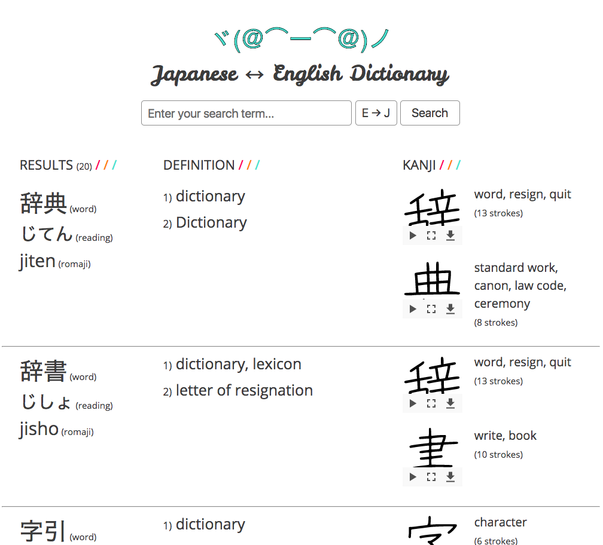

#Japanese Dictionary

This is a simple Japanese dictionary. For each word, it displays their reading, definitions, and information about the kanji contained in the word. Users can search in either Japanese or English, with a toggle button next to the input bar. Japanese searches are allowed in romaji (the latin alphabet) or Japanese characters.

The results are displayed five at a time with the ability to load more by scrolling to the end of the page. Kanji stroke order diagrams are provided in the kanji section and can be played by clicking the play button. They show the order that a kanji is written in.

The app was written in HTML, CSS, JavaScript, and jQuery, with browserify to allow the use of wanakana for text conversion from hiragana to romaji. It uses the [Jisho API](http://jisho.org/forum/54fefc1f6e73340b1f160000-is-there-any-kind-of-search-api) to find words and definitions, and the [Kanji Alive API](https://app.kanjialive.com/api/docs) for kanji data.
